# 🏗️ Data Cloud Personalization App - Architecture Flowchart

## Complete System Architecture

```mermaid
flowchart TB
    %% ============================================
    %% ENTERPRISE DATA SOURCES
    %% ============================================
    subgraph Sources["📊 Enterprise Data Sources"]
        CRM["🏢 Salesforce CRM<br/>Accounts, Contacts, Leads, Cases"]
        Marketing["📧 Marketing Cloud<br/>Email, SMS, Push Campaigns"]
        Website["🌐 Website Analytics<br/>Product Views, Cart, Purchases"]
        Mobile["📱 Mobile App<br/>Push Notifications, In-App Events"]
        WhatsApp["💬 WhatsApp Business API<br/>Message Engagement"]
        Health["⚕️ Health Systems<br/>Health Profiles, Fitness Data"]
        Ecommerce["🛒 E-commerce Platform<br/>Purchase History, Preferences"]
        Social["📱 Social Media<br/>Engagement, Sentiment"]
    end

    %% ============================================
    %% DATA CLOUD - DATA INGESTION & PROCESSING
    %% ============================================
    subgraph DataCloud["☁️ Salesforce Data Cloud"]
        
        subgraph Ingestion["📥 Data Ingestion"]
            DataStreams["Data Streams<br/>Real-time & Batch"]
            Connectors["Data Connectors<br/>API, ETL, Streaming"]
        end
        
        subgraph Processing["🔄 Data Processing"]
            Harmonization["Data Harmonization<br/>Schema Mapping, Normalization"]
            IdentityResolution["Identity Resolution<br/>Match & Link Records"]
            UnifiedProfile["Unified Profile Creation<br/>Single Source of Truth"]
        end
        
        subgraph Insights["💡 Insights Creation"]
            UnstructuredProc["Unstructured Data Processing<br/>NLP, OCR, Image Recognition, Computer Vision"]
            StructuredProc["Structured Data Processing<br/>Calculated Insights, Predictive AI Models"]
            UnstructuredInsights["Unstructured Insights<br/>Sentiment, Lifestyle, Health Profile, Purchase Intent, Hobby, Affinities, Imminent Event"]
            StructuredInsights["Structured Insights<br/>Lifetime Value, Loyalty Tier, Favourite Brand, Preferred Channel, Preferred Send Schedule"]
        end
        
        subgraph Profile360["📊 Profile 360 Graph"]
            UnifiedProfileData["Unified Profile<br/>Demographics, Identity"]
            InsightsTimeSeries["Insights on Time Axis<br/>Temporal Structured & Unstructured Insights<br/>Historical & Real-time"]
            Profile360Graph["Dynamic Profile 360 Graph<br/>Unified Profile + Temporal Insights"]
        end
    end

    %% ============================================
    %% HEROKU APP - MCP CONNECTION
    %% ============================================
    subgraph HerokuApp["🚀 Heroku Application"]
        
        subgraph MCP["🔌 MCP Server Connection"]
            MCPConfig["MCP Configuration<br/>salesforce-apis"]
            Credentials["Credentials<br/>Username/Password/OAuth"]
            MCPTools["MCP Tools<br/>query, describe, create"]
        end
        
        subgraph Segmentation["🎯 Smart Audience Building"]
            SegmentEngine["Segmentation Engine<br/>Dynamic Segment Creation"]
            AIAgent["AI Agent<br/>Natural Language Processing"]
            CriteriaBuilder["Criteria Builder<br/>Multi-dimensional Filtering"]
        end
        
        subgraph Personalization["🎨 Personalization Engine"]
            PromptGen["Dynamic Prompt Generator<br/>Exercise, Brand, Destination, Lifestyle"]
            Gemini["Google Gemini Nano Banana<br/>Gemini 2.5 Flash Image"]
            Replicate["Replicate API<br/>SDXL + Face-Swap"]
            ImageGen["Personalized Image Generator<br/>Face-Swap + Brand Integration"]
            ContentGen["Content Generator<br/>Text, Offers, Links"]
        end
        
        subgraph Messaging["📤 Messaging Engine"]
            ChannelRouter["Channel Router<br/>Preferred Channel Detection"]
            EmailEngine["Email Engine<br/>HTML, Personalization"]
            SMSEngine["SMS Engine<br/>Short-form Content"]
            WhatsAppEngine["WhatsApp Engine<br/>Rich Media"]
            PushEngine["Push Engine<br/>Notifications"]
        end
    end

    %% ============================================
    %% DELIVERY CHANNELS
    %% ============================================
    subgraph Channels["📤 Delivery Channels"]
        Email["📧 Email<br/>Marketing Cloud"]
        SMS["💬 SMS<br/>Mobile Studio"]
        WhatsAppDel["💬 WhatsApp<br/>Business API"]
        Push["🔔 Push Notification<br/>Mobile App"]
        WebsiteDel["🌐 Website<br/>Personalized Banners"]
    end

    %% ============================================
    %% FLOW CONNECTIONS
    %% ============================================
    
    %% Enterprise Sources to Data Cloud
    CRM --> DataStreams
    Marketing --> DataStreams
    Website --> DataStreams
    Mobile --> DataStreams
    WhatsApp --> DataStreams
    Health --> DataStreams
    Ecommerce --> DataStreams
    Social --> DataStreams
    
    DataStreams --> Connectors
    Connectors --> Harmonization
    
    %% Data Cloud Internal Processing
    Harmonization --> IdentityResolution
    IdentityResolution --> UnifiedProfile
    UnifiedProfile --> UnifiedProfileData
    
    %% Insights Creation
    Harmonization --> UnstructuredProc
    Harmonization --> StructuredProc
    UnstructuredProc --> UnstructuredInsights
    StructuredProc --> StructuredInsights
    
    %% Profile 360 Graph Creation - Both insights are temporal and marry with unified profile
    UnifiedProfileData --> InsightsTimeSeries
    UnstructuredInsights --> InsightsTimeSeries
    StructuredInsights --> InsightsTimeSeries
    InsightsTimeSeries --> Profile360Graph
    UnifiedProfileData --> Profile360Graph
    
    %% Heroku App Connection via MCP
    Profile360Graph --> MCPConfig
    MCPConfig --> Credentials
    Credentials --> MCPTools
    
    %% Segmentation
    MCPTools --> SegmentEngine
    Profile360Graph --> AIAgent
    AIAgent --> SegmentEngine
    SegmentEngine --> CriteriaBuilder
    
    %% Personalization
    Profile360Graph --> PromptGen
    CriteriaBuilder --> PromptGen
    PromptGen --> Gemini
    PromptGen --> Replicate
    Gemini --> ImageGen
    Replicate --> ImageGen
    Profile360Graph --> ContentGen
    ImageGen --> ContentGen
    
    %% Messaging & Routing
    ContentGen --> ChannelRouter
    Profile360Graph --> ChannelRouter
    ChannelRouter --> EmailEngine
    ChannelRouter --> SMSEngine
    ChannelRouter --> WhatsAppEngine
    ChannelRouter --> PushEngine
    
    %% Delivery
    EmailEngine --> Email
    SMSEngine --> SMS
    WhatsAppEngine --> WhatsAppDel
    PushEngine --> Push
    ChannelRouter --> WebsiteDel
    
    %% Feedback Loop
    Email -.-> DataStreams
    SMS -.-> DataStreams
    WhatsAppDel -.-> DataStreams
    Push -.-> DataStreams
    WebsiteDel -.-> DataStreams

    %% ============================================
    %% STYLING
    %% ============================================
    classDef sourceStyle fill:#e1f5ff,stroke:#01579b,stroke-width:2px
    classDef datacloudStyle fill:#f3e5f5,stroke:#4a148c,stroke-width:3px
    classDef ingestionStyle fill:#e8eaf6,stroke:#283593,stroke-width:2px
    classDef processingStyle fill:#e0f2f1,stroke:#00695c,stroke-width:2px
    classDef insightsStyle fill:#fff3e0,stroke:#e65100,stroke-width:2px
    classDef profile360Style fill:#e8f5e9,stroke:#1b5e20,stroke-width:3px
    classDef herokuStyle fill:#fce4ec,stroke:#880e4f,stroke-width:2px
    classDef mcpStyle fill:#fff9c4,stroke:#f57f17,stroke-width:2px
    classDef segmentationStyle fill:#e1bee7,stroke:#6a1b9a,stroke-width:2px
    classDef personalizationStyle fill:#b2ebf2,stroke:#006064,stroke-width:2px
    classDef messagingStyle fill:#c8e6c9,stroke:#2e7d32,stroke-width:2px
    classDef channelStyle fill:#e3f2fd,stroke:#0d47a1,stroke-width:2px

    class CRM,Marketing,Website,Mobile,WhatsApp,Health,Ecommerce,Social sourceStyle
    class DataCloud,Ingestion,Processing,Insights,Profile360 datacloudStyle
    class DataStreams,Connectors ingestionStyle
    class Harmonization,IdentityResolution,UnifiedProfile processingStyle
    class UnstructuredProc,StructuredProc,UnstructuredInsights,StructuredInsights insightsStyle
    class UnifiedProfileData,InsightsTimeSeries,Profile360Graph profile360Style
    class HerokuApp,MCP,Segmentation,Personalization,Messaging herokuStyle
    class MCPConfig,Credentials,MCPTools mcpStyle
    class SegmentEngine,AIAgent,CriteriaBuilder segmentationStyle
    class PromptGen,Gemini,Replicate,ImageGen,ContentGen personalizationStyle
    class ChannelRouter,EmailEngine,SMSEngine,WhatsAppEngine,PushEngine messagingStyle
    class Email,SMS,WhatsAppDel,Push,WebsiteDel channelStyle
```

## 📊 Profile 360 Graph - Detailed Architecture

```mermaid
flowchart TB
    %% ============================================
    %% PROFILE 360 GRAPH COMPONENTS
    %% ============================================
    subgraph Profile360["📊 Profile 360 Graph Architecture"]
        
        subgraph Unified["👤 Unified Profile"]
            Identity["Identity Resolution<br/>• Email Match<br/>• Phone Match<br/>• Device ID Match<br/>• Social ID Match"]
            Demographics["Demographics<br/>• Name, Age, Location<br/>• Contact Information<br/>• Device Information"]
            UnifiedRecord["Unified Individual Record<br/>Single Source of Truth"]
        end
        
        subgraph Insights["💡 Insights Layer"]
            
            subgraph Structured["📋 Structured Insights"]
                StructuredProc["Structured Data Processing<br/>• Calculated Insights<br/>• Predictive AI Models"]
                StructuredInsights["Structured Insights<br/>• Lifetime Value<br/>• Loyalty Tier<br/>• Favourite Brand<br/>• Preferred Channel<br/>• Preferred Send Schedule"]
            end
            
            subgraph Unstructured["📝 Unstructured Insights"]
                UnstructuredProc["Unstructured Data Processing<br/>• NLP (Natural Language Processing)<br/>• OCR (Optical Character Recognition)<br/>• Image Recognition<br/>• Computer Vision"]
                UnstructuredInsights["Unstructured Insights<br/>• Sentiment<br/>• Lifestyle<br/>• Health Profile<br/>• Purchase Intent"]
            end
        end
        
        subgraph TimeAxis["⏱️ Time Axis Dimension"]
            Historical["Historical Data<br/>• Past 30 Days<br/>• Past 90 Days<br/>• Past 1 Year<br/>• Lifetime"]
            RealTime["Real-Time Data<br/>• Last Hour<br/>• Last 24 Hours<br/>• Current State"]
            Trends["Trend Analysis<br/>• Engagement Trends<br/>• Behavior Changes<br/>• Milestone Progression<br/>• Sentiment Shifts"]
        end
        
        subgraph Graph["🕸️ Profile 360 Graph"]
            Nodes["Graph Nodes<br/>• Individual<br/>• Insights<br/>• Events<br/>• Relationships"]
            Edges["Graph Edges<br/>• Temporal Links<br/>• Causal Links<br/>• Correlation Links"]
            GraphStructure["Profile 360 Graph Structure<br/>Unified Profile + Insights on Time Axis"]
        end
    end
    
    %% ============================================
    %% CONNECTIONS
    %% ============================================
    Identity --> Demographics
    Demographics --> UnifiedRecord
    
    StructuredProc --> StructuredInsights
    UnstructuredProc --> UnstructuredInsights
    
    %% Both insights are temporal on time axis
    StructuredInsights --> Historical
    UnstructuredInsights --> Historical
    Historical --> RealTime
    RealTime --> Trends
    
    %% Unified profile marries with temporal insights to create Dynamic Profile 360 Graph
    UnifiedRecord --> Nodes
    StructuredInsights --> Nodes
    UnstructuredInsights --> Nodes
    Historical --> Edges
    RealTime --> Edges
    Trends --> Edges
    
    Nodes --> GraphStructure
    Edges --> GraphStructure
    
    %% ============================================
    %% STYLING
    %% ============================================
    classDef unifiedStyle fill:#e8f5e9,stroke:#1b5e20,stroke-width:2px
    classDef structuredStyle fill:#fff3e0,stroke:#e65100,stroke-width:2px
    classDef unstructuredStyle fill:#e1bee7,stroke:#6a1b9a,stroke-width:2px
    classDef timeStyle fill:#b2ebf2,stroke:#006064,stroke-width:2px
    classDef graphStyle fill:#f3e5f5,stroke:#4a148c,stroke-width:3px
    
    class Identity,Demographics,UnifiedRecord unifiedStyle
    class StructuredProc,StructuredInsights structuredStyle
    class UnstructuredProc,UnstructuredInsights unstructuredStyle
    class Historical,RealTime,Trends timeStyle
    class Nodes,Edges,GraphStructure graphStyle
```

## 🔄 Detailed Process Flow

### **Phase 1: Data Ingestion into Data Cloud**
1. **Enterprise Sources** → Multiple systems feed data directly into Data Cloud
   - Salesforce CRM (Accounts, Contacts, Leads, Cases)
   - Marketing Cloud (Email, SMS, Push campaigns)
   - Website Analytics (Product views, cart, purchases)
   - Mobile App (Push notifications, in-app events)
   - WhatsApp Business API (Message engagement)
   - Health Systems (Health profiles, fitness data)
   - E-commerce Platform (Purchase history, preferences)
   - Social Media (Engagement, sentiment)

2. **Data Streams** → Real-time and batch data ingestion
   - Streaming connectors for real-time events
   - ETL processes for batch data
   - API integrations for on-demand data

### **Phase 2: Data Cloud Internal Processing**

#### **2.1 Data Harmonization**
- Schema mapping across different source systems
- Data normalization and standardization
- Field mapping and transformation
- Data quality validation

#### **2.2 Identity Resolution**
- Match records across multiple sources
- Link related records using:
  - Email addresses
  - Phone numbers
  - Device IDs
  - Social media IDs
  - Custom identifiers
- Create unified identity graph

#### **2.3 Unified Profile Creation**
- Single source of truth for each individual
- Merge demographic data from all sources
- Resolve conflicts and prioritize data
- Create Unified Individual record

### **Phase 3: Insights Creation**

#### **3.1 Unstructured Data Processing**
- **Processing Technologies**:
  - **NLP (Natural Language Processing)**: Sentiment analysis, entity extraction, topic modeling, intent detection
  - **OCR (Optical Character Recognition)**: Extract text from images, documents, scanned files
  - **Image Recognition**: Identify objects, scenes, activities in images
  - **Computer Vision**: Analyze visual content, detect patterns, extract insights from images/videos
- **Data Sources**:
  - Support case descriptions
  - Social media posts and comments
  - Product reviews
  - Chat transcripts
  - Images and photos
  - Documents and scanned files
  - Video content
- **Output**: **Unstructured Insights**
  - Sentiment (positive, negative, neutral)
  - Lifestyle (Active, Luxury Seeker, Adventurer, etc.)
  - Health Profile (Fit, Active, Hypertensive, etc.)
  - Purchase Intent (High, Medium, Low)
  - Topics of Interest
  - Behavioral Patterns

#### **3.2 Structured Data Processing**
- **Processing Methods**:
  - **Calculated Insights**: Aggregations, scores, metrics from structured data
  - **Predictive AI Models**: Machine learning models for predictions and classifications
- **Data Sources**:
  - Engagement metrics (email, SMS, WhatsApp, push, website)
  - Transaction data
  - Behavioral data
  - Demographic data
  - Historical patterns
- **Output**: **Structured Insights**
  - Lifetime Value (LTV)
  - Loyalty Tier (Bronze, Silver, Gold, Platinum)
  - Favourite Brand (Nike, Samsung, Bose, etc.)
  - Preferred Channel (Email, SMS, WhatsApp, Push)
  - Preferred Send Schedule (Morning, Afternoon, Evening, Lunch Time)
  - Engagement Scores
  - Risk Scores
  - Fitness Milestone Progression

#### **3.3 Temporal Insights on Time Axis**
- Both **Unstructured Insights** and **Structured Insights** are stored on a **Time Axis**
- **Historical Data**: Past 30 days, 90 days, 1 year, lifetime
- **Real-Time Data**: Last hour, last 24 hours, current state
- **Trend Analysis**: Changes over time, progression patterns, shifts in behavior
- Insights evolve and change over time, creating a temporal dimension

### **Phase 4: Profile 360 Graph Creation**

#### **4.1 Unified Profile Component**
- Demographics (name, age, location, contact info)
- Identity resolution results
- Device information
- Contact preferences

#### **4.2 Insights on Time Axis**
- **Historical Data**:
  - Past 30 days engagement
  - Past 90 days behavior
  - Past 1 year trends
  - Lifetime metrics
- **Real-Time Data**:
  - Last hour activity
  - Last 24 hours engagement
  - Current state snapshot
- **Trend Analysis**:
  - Engagement trend changes
  - Behavior pattern shifts
  - Milestone progression (e.g., Beginner → Intermediate → Advanced)
  - Sentiment shifts over time

#### **4.3 Dynamic Profile 360 Graph Structure**
- **Unified Profile**: Demographics, identity, contact information
- **Temporal Structured Insights**: Lifetime value, loyalty tier, favourite brand, preferred channel, preferred send schedule (all on time axis)
- **Temporal Unstructured Insights**: Sentiment, lifestyle, health profile, purchase intent (all on time axis)
- **Nodes**: Individual, Insights (structured & unstructured), Events, Relationships
- **Edges**: Temporal links (time-based), Causal links (cause-effect), Correlation links (related insights)
- **Result**: **Dynamic Profile 360 Graph** - Unified profile married with both structured and unstructured insights, all temporal on the time axis, creating a complete, evolving view of each individual

### **Phase 5: Heroku App Connection via MCP**

1. **MCP Server Connection**:
   - Configure MCP server (`salesforce-apis`)
   - Authenticate with credentials (Username/Password or OAuth)
   - Access MCP tools (query, describe, create)

2. **Access Profile 360 Graph**:
   - Query Unified Individual records
   - Retrieve insights (structured and unstructured)
   - Access time-series data
   - Get complete Profile 360 Graph view

### **Phase 6: Smart Audience Building & Segmentation**

1. **AI Agent**:
   - Natural language processing for segment requests
   - Example: "Create a segment of 5 most highly engaged individuals"
   - Translates to SOQL queries

2. **Segmentation Engine**:
   - Dynamic segment creation based on criteria:
     - Engagement scores
     - Behavioral patterns
     - Demographics
     - Insights (sentiment, lifestyle, health)
   - Multi-dimensional filtering
   - Real-time segment updates

3. **Criteria Builder**:
   - Combine multiple filters
   - Complex logic (AND/OR conditions)
   - Time-based criteria

### **Phase 7: Personalization Engine**

1. **Dynamic Prompt Generation**:
   - Extract from Profile 360 Graph:
     - Favorite Exercise (Treadmill, Yoga, CrossFit, etc.)
     - Favorite Brand (Nike, Samsung, Bose, etc.)
     - Favorite Destination (Singapore, Maldives, Paris, etc.)
     - Lifestyle Quotient (Active, Luxury Seeker, etc.)
     - Health Profile & Fitness Milestone
     - Current Sentiment
     - Upcoming Events

2. **Image Generation**:
   - **Gemini Nano Banana**: 
     - Character-consistent generation
     - Uses profile picture as reference
     - Single-step generation
   - **Replicate**: 
     - SDXL base image generation
     - Face-swap for true face matching
     - Two-step process for accuracy

3. **Content Generation**:
   - Promotional text overlay:
     - Health alerts (if health profile not "Fit")
     - Milestone offers (50% discount on premium subscription)
     - Congratulatory messages (milestone progression)
   - Dynamic links:
     - Vacation flight booking (if upcoming event is "vacation")
     - Guitar purchase discount (if hobby is "playing guitar")
   - Multi-line text wrapping
   - Brand integration (visible gadgets/apparel)

### **Phase 8: Messaging Engine & Channel Routing**

1. **Channel Router**:
   - Analyze Profile 360 Graph for channel preferences
   - Calculate engagement scores per channel:
     - Email engagement score
     - SMS engagement score
     - WhatsApp engagement score
     - Push engagement score
   - Select preferred channel (highest score)

2. **Content Formatting**:
   - **Email Engine**: HTML email with personalized content, images, offers
   - **SMS Engine**: Short-form personalized text messages
   - **WhatsApp Engine**: Rich media (images, videos) + text
   - **Push Engine**: Notification with personalized content

3. **Delivery**:
   - Route to preferred channel
   - Send via appropriate platform:
     - Email → Marketing Cloud
     - SMS → Mobile Studio
     - WhatsApp → Business API
     - Push → Mobile App
     - Website → Personalized banners

### **Phase 9: Feedback Loop**

- Engagement metrics from delivered content feed back into Data Cloud
- Updates Profile 360 Graph with new engagement data
- Continuous learning and optimization
- Real-time profile updates

## 📊 Key Components

### **Data Cloud - Internal Processing**
- **Data Harmonization**: Schema mapping, normalization, standardization
- **Identity Resolution**: Match and link records across sources
- **Unified Profile**: Single source of truth for each individual
- **Unstructured Processing**: NLP, sentiment analysis, entity extraction
- **Calculated Insights**: Aggregations, scores, metrics from structured data
- **Profile 360 Graph**: Unified profile + insights on time axis

### **Profile 360 Graph Structure**
- **Unified Profile**: Demographics, identity, contact info
- **Structured Insights**: Engagement metrics, behavioral patterns, calculated scores
- **Unstructured Insights**: Sentiment, topics, intents from text data
- **Time Axis**: Historical data, real-time data, trend analysis
- **Graph Nodes**: Individual, insights, events, relationships
- **Graph Edges**: Temporal, causal, and correlation links

### **Heroku App - MCP Integration**
- **MCP Server**: `salesforce-apis` protocol
- **Authentication**: Username/Password or OAuth
- **Tools**: Query, Describe, Create Salesforce objects
- **Access**: Profile 360 Graph via SOQL queries

### **Smart Audience Building**
- **AI Agent**: Natural language processing for segment requests
- **Segmentation Engine**: Dynamic segment creation with multi-dimensional filtering
- **Criteria Builder**: Complex logic for segment criteria

### **Personalization Engine**
- **Dynamic Prompts**: Context-aware prompt generation from Profile 360
- **Gemini**: Character-consistent image generation
- **Replicate**: Face-swap for accurate face matching
- **Content Generation**: Text, offers, links, overlays

### **Messaging Engine**
- **Channel Router**: Preferred channel detection based on engagement scores
- **Content Formatting**: Channel-specific content formatting
- **Multi-Channel Delivery**: Email, SMS, WhatsApp, Push, Website

## 🎯 Use Cases

1. **Hyper-Personalized Campaigns**: Generate unique images for each individual based on their complete Profile 360 Graph
2. **Milestone Celebrations**: Detect fitness progression from time-series data and send congratulatory offers
3. **Health Alerts**: Identify health risks from unstructured insights and route to appropriate channels
4. **Channel Optimization**: Automatically route to best-performing channel per individual based on engagement history
5. **Real-Time Personalization**: Update content based on latest insights from Profile 360 Graph
6. **Sentiment-Based Messaging**: Adjust messaging tone based on current sentiment from unstructured data processing
7. **Trend-Based Offers**: Identify behavior trends and offer relevant products/services

## 🔐 Security & Compliance

- **Data Cloud Security**: Enterprise-grade security for data ingestion and processing
- **MCP Authentication**: Secure credential management for Heroku app
- **Data Privacy**: Respects consent preferences per channel
- **GDPR Compliance**: Data Cloud handles privacy regulations
- **Secure APIs**: OAuth 2.0 for Salesforce connections
- **Identity Resolution**: Privacy-preserving matching algorithms

---

**Generated**: 2025-01-30
**Version**: v110
**Architecture**: Data Cloud-Centric + Profile 360 Graph + MCP + AI Personalization + Multi-Channel Delivery
