# 🏗️ Data Cloud Personalization App - Architecture Flowchart

## Complete System Architecture

```mermaid
flowchart TB
    %% ============================================
    %% ENTERPRISE DATA SOURCES
    %% ============================================
    subgraph Sources["📊 Enterprise Data Sources"]
        CRM["🏢 Salesforce CRM<br/>Accounts, Contacts, Leads"]
        Marketing["📧 Marketing Cloud<br/>Email, SMS, Push Campaigns"]
        Website["🌐 Website Analytics<br/>Product Views, Cart, Purchases"]
        Mobile["📱 Mobile App<br/>Push Notifications, In-App Events"]
        WhatsApp["💬 WhatsApp Business<br/>Message Engagement"]
        Health["⚕️ Health Systems<br/>Health Profiles, Fitness Data"]
        Ecommerce["🛒 E-commerce Platform<br/>Purchase History, Preferences"]
    end

    %% ============================================
    %% DATA CLOUD CONNECTION VIA MCP
    %% ============================================
    subgraph MCP["🔌 MCP Server Connection"]
        MCPConfig["MCP Configuration<br/>salesforce-apis"]
        Credentials["Credentials<br/>Username/Password/OAuth"]
        MCPTools["MCP Tools<br/>query, describe, create"]
    end

    subgraph DataCloud["☁️ Salesforce Data Cloud"]
        DMO["Data Model Objects<br/>Individual, Engagement, Insights"]
        Unified["Unified Individual<br/>Identity Resolution"]
        Segments["Segments<br/>Dynamic & Static"]
        Activations["Activations<br/>Channel Routing"]
    end

    %% ============================================
    %% PROFILE 360 SYNTHESIS
    %% ============================================
    subgraph Profile360["🎯 Profile 360 Graph Synthesis"]
        EngagementData["Engagement Metrics<br/>Email, SMS, WhatsApp, Push, Website"]
        InsightsData["Behavioral Insights<br/>Sentiment, Lifestyle, Health, Fitness"]
        Demographics["Demographics<br/>Location, Age, Preferences"]
        ChannelPref["Channel Preferences<br/>Preferred Channel Score"]
        
        Synthesis["🔄 Data Synthesis Engine<br/>Merge & Enrich"]
        Profile360Graph["📊 Profile 360 Graph<br/>Complete Individual View"]
    end

    %% ============================================
    %% AI PERSONALIZATION ENGINES
    %% ============================================
    subgraph AI["🤖 AI Personalization Engines"]
        Gemini["Google Gemini Nano Banana<br/>Gemini 2.5 Flash Image<br/>Character-Consistent Generation"]
        Replicate["Replicate API<br/>SDXL + Face-Swap<br/>True Face Matching"]
        PromptGen["Dynamic Prompt Generator<br/>Exercise, Brand, Destination, Lifestyle"]
        ImageGen["Personalized Image Generator<br/>Face-Swap + Brand Integration"]
    end

    %% ============================================
    %% CONTENT GENERATION
    %% ============================================
    subgraph Content["📝 Content Generation"]
        ImageContent["AI-Generated Images<br/>Profile Picture + Exercise + Brand + Destination"]
        TextOverlay["Promotional Overlay<br/>Health Alerts, Milestone Offers, Links"]
        EmailContent["Email Content<br/>Personalized Subject & Body"]
        SMSContent["SMS Content<br/>Short-form Personalization"]
        WhatsAppContent["WhatsApp Content<br/>Rich Media + Text"]
    end

    %% ============================================
    %% SEGMENTATION & ROUTING
    %% ============================================
    subgraph Routing["🎯 Segmentation & Channel Routing"]
        SegmentEngine["Segmentation Engine<br/>Create Dynamic Segments"]
        AIAgent["AI Agent<br/>Natural Language Processing"]
        ChannelRouter["Channel Router<br/>Preferred Channel Detection"]
    end

    %% ============================================
    %% DELIVERY CHANNELS
    %% ============================================
    subgraph Channels["📤 Delivery Channels"]
        Email["📧 Email<br/>Marketing Cloud"]
        SMS["💬 SMS<br/>Mobile Studio"]
        WhatsAppDel["💬 WhatsApp<br/>Business API"]
        Push["🔔 Push Notification<br/>Mobile App"]
        WebsiteDel["🌐 Website<br/>Personalized Banners"]
    end

    %% ============================================
    %% FLOW CONNECTIONS
    %% ============================================
    
    %% Sources to Data Cloud
    CRM --> MCP
    Marketing --> MCP
    Website --> MCP
    Mobile --> MCP
    WhatsApp --> MCP
    Health --> MCP
    Ecommerce --> MCP

    %% MCP to Data Cloud
    MCPConfig --> Credentials
    Credentials --> MCPTools
    MCPTools --> DataCloud
    DataCloud --> DMO
    DMO --> Unified
    Unified --> Segments
    Segments --> Activations

    %% Data Cloud to Profile 360
    DMO --> EngagementData
    DMO --> InsightsData
    DMO --> Demographics
    DMO --> ChannelPref
    
    EngagementData --> Synthesis
    InsightsData --> Synthesis
    Demographics --> Synthesis
    ChannelPref --> Synthesis
    Synthesis --> Profile360Graph

    %% Profile 360 to AI Engines
    Profile360Graph --> PromptGen
    PromptGen --> Gemini
    PromptGen --> Replicate
    Gemini --> ImageGen
    Replicate --> ImageGen
    ImageGen --> ImageContent
    ImageContent --> TextOverlay

    %% Profile 360 to Content Generation
    Profile360Graph --> EmailContent
    Profile360Graph --> SMSContent
    Profile360Graph --> WhatsAppContent

    %% Content to Routing
    ImageContent --> SegmentEngine
    EmailContent --> SegmentEngine
    SMSContent --> SegmentEngine
    WhatsAppContent --> SegmentEngine
    Profile360Graph --> AIAgent
    AIAgent --> SegmentEngine
    SegmentEngine --> ChannelRouter

    %% Routing to Channels
    ChannelRouter --> Email
    ChannelRouter --> SMS
    ChannelRouter --> WhatsAppDel
    ChannelRouter --> Push
    ChannelRouter --> WebsiteDel

    %% Activations to Channels
    Activations --> Email
    Activations --> SMS
    Activations --> WhatsAppDel
    Activations --> Push

    %% ============================================
    %% STYLING
    %% ============================================
    classDef sourceStyle fill:#e1f5ff,stroke:#01579b,stroke-width:2px
    classDef mcpStyle fill:#fff3e0,stroke:#e65100,stroke-width:2px
    classDef datacloudStyle fill:#f3e5f5,stroke:#4a148c,stroke-width:2px
    classDef profileStyle fill:#e8f5e9,stroke:#1b5e20,stroke-width:2px
    classDef aiStyle fill:#fff9c4,stroke:#f57f17,stroke-width:2px
    classDef contentStyle fill:#fce4ec,stroke:#880e4f,stroke-width:2px
    classDef routingStyle fill:#e0f2f1,stroke:#004d40,stroke-width:2px
    classDef channelStyle fill:#e3f2fd,stroke:#0d47a1,stroke-width:2px

    class CRM,Marketing,Website,Mobile,WhatsApp,Health,Ecommerce sourceStyle
    class MCPConfig,Credentials,MCPTools mcpStyle
    class DMO,Unified,Segments,Activations,DataCloud datacloudStyle
    class EngagementData,InsightsData,Demographics,ChannelPref,Synthesis,Profile360Graph profileStyle
    class Gemini,Replicate,PromptGen,ImageGen aiStyle
    class ImageContent,TextOverlay,EmailContent,SMSContent,WhatsAppContent contentStyle
    class SegmentEngine,AIAgent,ChannelRouter routingStyle
    class Email,SMS,WhatsAppDel,Push,WebsiteDel channelStyle
```

## 🔄 Detailed Process Flow

### **Phase 1: Data Ingestion**
1. **Enterprise Sources** → Multiple systems feed data
2. **MCP Connection** → Authenticated connection to Salesforce Data Cloud
3. **Data Cloud Storage** → Unified data model objects

### **Phase 2: Profile 360 Synthesis**
1. **Engagement Metrics** → Email opens/clicks, SMS engagement, WhatsApp reads, Push opens, Website activity
2. **Behavioral Insights** → Sentiment, lifestyle quotient, health profile, fitness milestone, purchase intent
3. **Demographics** → Location, age, preferences, brand affinity
4. **Channel Preferences** → Calculated preferred channel based on engagement scores
5. **Synthesis** → All data merged into complete Profile 360 Graph

### **Phase 3: AI Personalization**
1. **Dynamic Prompt Generation** → Based on Profile 360 data:
   - Favorite Exercise (Treadmill, Yoga, CrossFit, etc.)
   - Favorite Brand (Nike, Samsung, Bose, etc.)
   - Favorite Destination (Singapore, Maldives, Paris, etc.)
   - Lifestyle Quotient (Active, Luxury Seeker, etc.)
   - Health Profile & Fitness Milestone
2. **Image Generation** → 
   - **Gemini**: Character-consistent generation using profile picture as reference
   - **Replicate**: SDXL base image + Face-swap for true face matching
3. **Content Enhancement** → 
   - Promotional text overlay (health alerts, milestone offers)
   - Dynamic links (vacation flights, guitar purchases)
   - Multi-line text wrapping

### **Phase 4: Segmentation & Routing**
1. **AI Agent** → Natural language processing for segment creation
2. **Segmentation Engine** → Dynamic segment creation based on criteria
3. **Channel Router** → Routes content to preferred channel:
   - Email (highest email engagement score)
   - SMS (highest SMS engagement score)
   - WhatsApp (highest WhatsApp engagement score)
   - Push (highest push engagement score)
   - Website (personalized banners)

### **Phase 5: Content Delivery**
1. **Data Cloud Activations** → Automated activation to Marketing Cloud
2. **Channel Delivery** → Content sent via preferred channel
3. **Engagement Tracking** → Metrics fed back to Data Cloud for continuous improvement

## 📊 Key Components

### **MCP Server Integration**
- **Protocol**: Model Context Protocol (MCP)
- **Server**: `salesforce-apis`
- **Authentication**: Username/Password or OAuth
- **Tools**: Query, Describe, Create, Update, Delete Salesforce objects

### **Profile 360 Graph**
- **Unified Identity**: Resolves individual across all sources
- **360° View**: Complete behavioral, demographic, and engagement profile
- **Time-Series Data**: Historical insights tracking over time
- **Real-Time Updates**: Continuous data refresh from sources

### **AI Personalization**
- **Gemini Nano Banana**: Single-step character-consistent generation
- **Replicate**: Two-step face-swap for accurate face matching
- **Dynamic Prompts**: Context-aware prompt generation
- **Brand Integration**: Visible gadgets/apparel in images

### **Channel Routing**
- **Score-Based**: Calculates engagement score per channel
- **Preference Detection**: Identifies highest-performing channel
- **Multi-Channel**: Supports Email, SMS, WhatsApp, Push, Website
- **Automated**: Data Cloud Activations handle delivery

## 🎯 Use Cases

1. **Hyper-Personalized Campaigns**: Generate unique images for each individual based on their complete profile
2. **Milestone Celebrations**: Detect fitness progression and send congratulatory offers
3. **Health Alerts**: Identify health risks and route to appropriate channels
4. **Channel Optimization**: Automatically route to best-performing channel per individual
5. **Real-Time Personalization**: Update content based on latest insights

## 🔐 Security & Compliance

- **MCP Authentication**: Secure credential management
- **Data Privacy**: Respects consent preferences per channel
- **GDPR Compliance**: Data Cloud handles privacy regulations
- **Secure APIs**: OAuth 2.0 for Salesforce connections

---

**Generated**: 2025-01-30
**Version**: v105
**Architecture**: Data Cloud + MCP + AI Personalization + Multi-Channel Delivery

